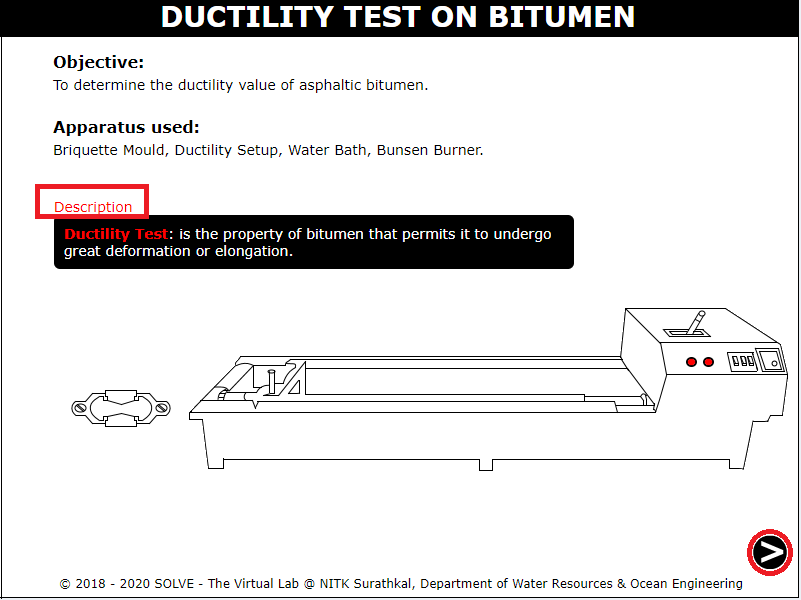
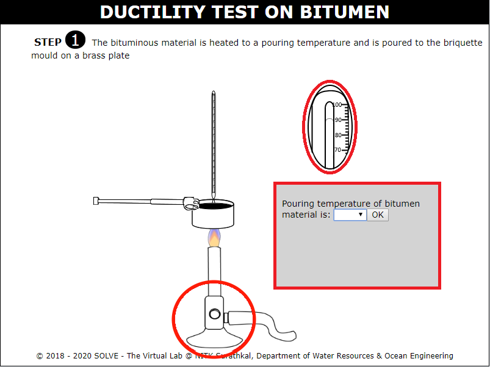
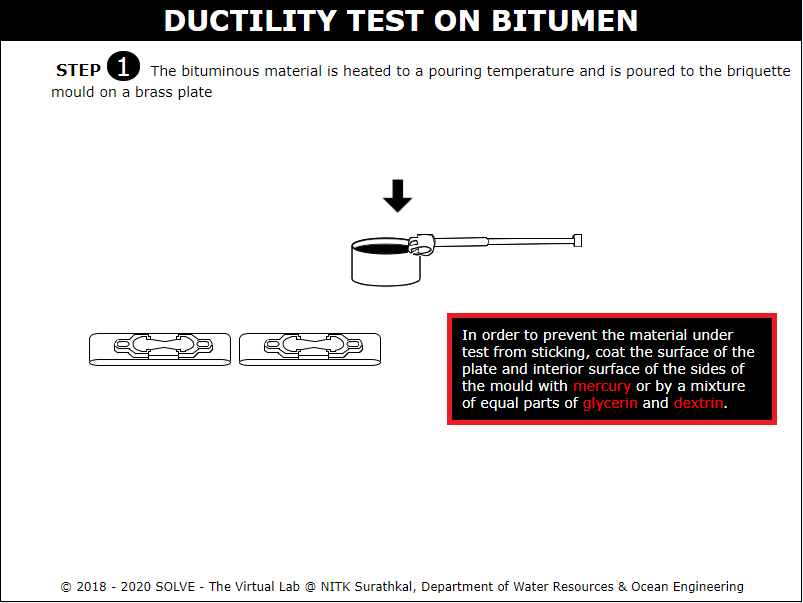
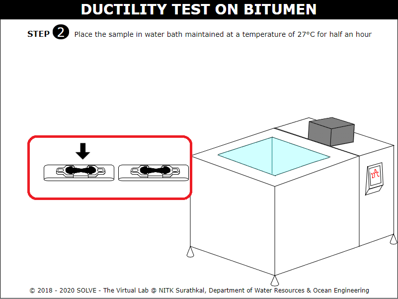
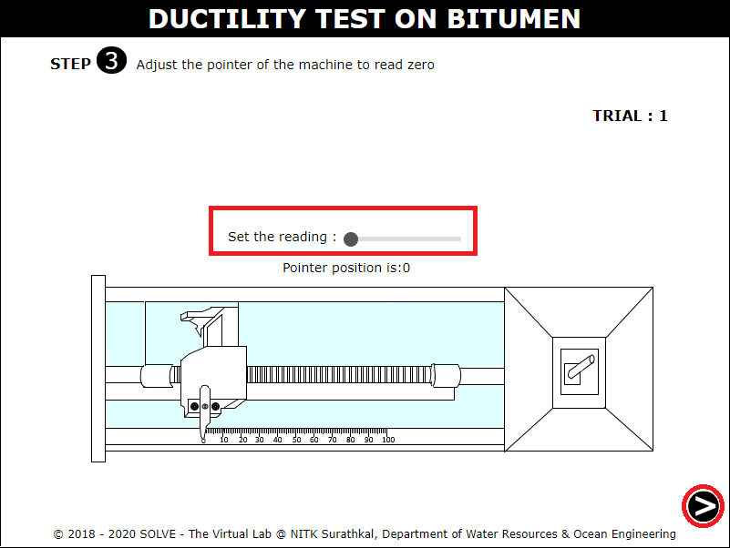
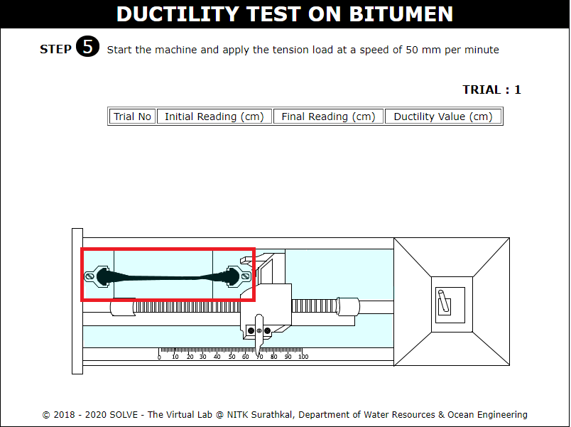
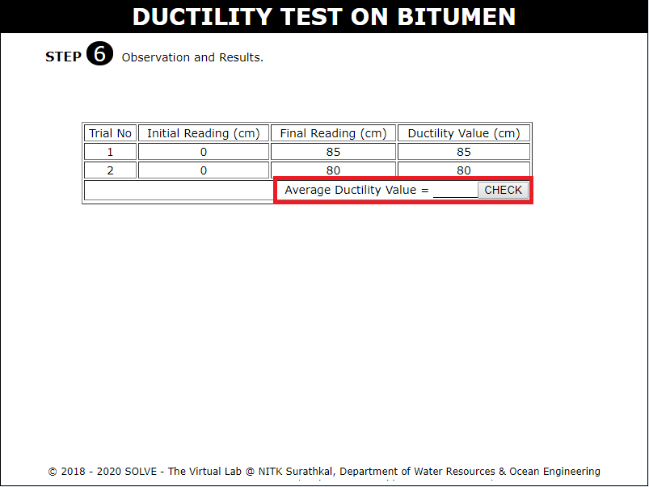
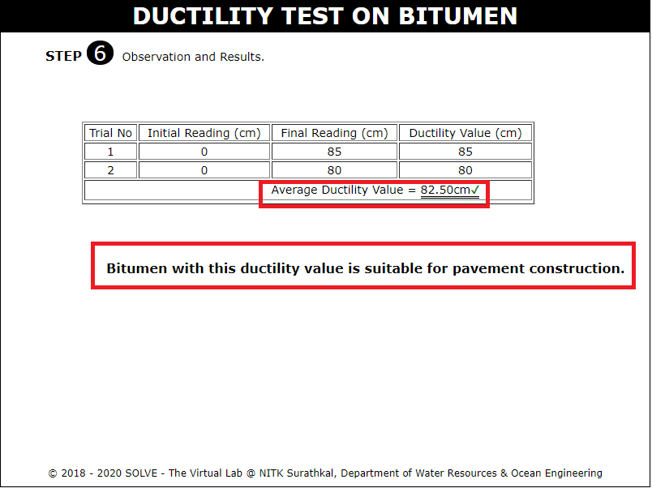

##### These procedure steps will be followed on the simulator

1. When you open Ductility test on bitumeen simulation, a window will open as shown below, click on Description to understand the terminologies, click on NEXT button to proceed. 
 

2. Answer the question by selecting the correct answer to proceed with the simulation, click on the bunsen burner to heat the bitumen sample to pouring temperature. 
 

3. Go through the instructions given then click on the specimen to pour the bitumen sample into the briquette mould on a brass plate. 
 

4. Click on the sample to place the sample in water bath maintained at 27° C. Click on NEXT button. 
 

5. Click on the adjustment to set the pointer reading to zero. Click on NEXT button to proceed. 
 

6. Click on the mould to place it in position and hook the clips carefully. Click on NEXT button to proceed. 
 

7. Click ON button to start the machine and pull the clip and note down the initial, final reading and ductility value for each trial. 
 

8. Repeat the above two steps for second trial and calculate the average ductility value the evaluate the entered result by clicking on CHECK button. 
 

9. Note down the obtained result and go through the inference drawn from it. 
 
