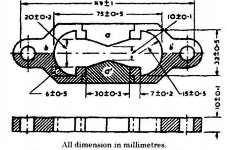

### INTRODUCTION 

Bitumen is the residue or by-product obtained by the refining of crude petroleum. A wide variety of refining techniques like straight distillation technique, solvent extraction technique etc are used to produce bitumen of different consistency and other desirable properties. Depending on the origin and other characteristics of the crude oil and property of bitumen required, more than one processing method may be employed. The type of construction decides the type of bitumen needs to be used. But in general good bitumen should have following properties.

<ol style="text-indent:25px; text-align:justify;list-style-position: inside">
<li><strong>Temperature susceptibility of bitumen</strong>: the bitumen mix should not become too soft or unstable during hot weather, and not become too brittle during cold weather.</li>

<li><strong>Viscosity of the bitumen</strong>: at the time of mixing and compaction should be adequate. This can be managed by the use of cutbacks or emulsions of suitable grades or heating the bitumen and aggregates prior to mixing.</li>

<li><strong>Affinity and adhesion of bitumen</strong>: There should be adequate affinity and adhesion between the bitumen and aggregates used in the mix.</li>
</ol>

Ductility is one such property of bitumen which is dependent on the purpose of construction. Ductility is the property that permits the material to undergo great deformation or elongation. Indirectly, ductility measures the adhesive property of bitumen and its ability to stretch. It is necessary that binder should form a thin ductile film around aggregates to improve the interlocking of the aggregates in flexible pavements. It is important in pavement to resist crack due to temperature or traffic stresses to avoid damage the pavement structure. Specifically, the ductility of a bituminous material is defined as the distance in centimeters, to which it will elongate before breaking when two ends of a briquette specimen of the material are pulled apart at a specified speed and a specified temperature. A temperature of 25 &plusmn; 0.5 &deg;C and pulling speed of 5 cm/min &plusmn; 5.0 % is to be maintained while carrying out the experiment. The ductility of a bitumen specimen mainly gives information about the tensile strength and ductility grade of bitumen.

  

Briquette Mould
 

(Source: IS 1208 -1978: Methods for Testing Tar and Bituminous Materials: Determination of Ductility)
 

Due to temperature stress’s roads expand at daytime and contract at night. So, if the bitumen is not adequately ductile cracking will occur. The ductility value of bitumen usually varies from 5 to over 100 cm’s and several standards have specified minimum ductility values for various pavement types. However a ductility value of 100 cm’s is specified generally for bituminous construction. Ductility value of bitumen varies based on source of it, the minimum values of ductility specified by ISI for various grades are as follows.

<table style="width:800px;margin-left: 0;text-align:center;">
<tr style="text-align:center">
<th style="text-align:center;height:50px;width:40%">Source of Paving Bitumen and Penetration Grade</th>
<th style="text-align:center;height:50px;width:20%">Min ductility value (cm)</th>
</tr>
<tr style="text-align:center;height:50px;">
<td> Assam Petroleum A25</td>
<td> 5</td>
</tr>
<tr style="text-align:center;height:50px;">
<td>A35</td>
<td>10</td>
</tr>
<tr style="text-align:center;height:50px;">
<td>A45</td>
<td>12</td>
</tr>
<tr style="text-align:center;height:50px;">
<td>A65, A90 and A200</td>
<td>15</td>
</tr>
<tr style="text-align:center;height:50px;">
<td>Bitumen from sources other than Assam Petroleum S35</td>
<td>50</td>
</tr>
<tr style="text-align:center;height:50px;">
<td>S45, S65 and S90 </td>
<td>75</td>
</tr>
</table>

(Source: The Constructor, Civil Engineering Home)
 

<strong>Relevant Indian Standard for Ductility Test on Bitumen</strong>: 

IS 1208 -1978 Edition 2.1 (2004-10): Methods for Testing Tar and Bituminous Materials: Determination of Ductility (First Revision).

